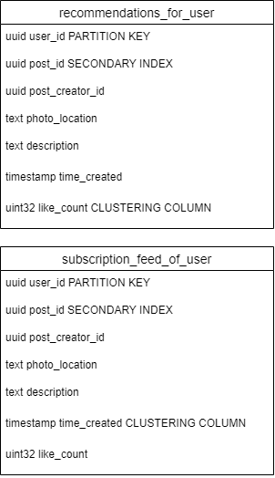

# naukma-aws

bla bla bla

# User service 
gRPC cервіс користувачів, виконує роль зберження користувачі та їх аутнефікації. 
## Сутності 
```protobuf
message User {
    string email = 1;
    string nickname = 2;
    string password = 3;
    string phoneNumber = 4;
    bool emailConfirmed = 5;
    string description = 5;
    bool isHidden = 6;
    Timestamp registredAt = 7;
}
```
## routes
### POST: /api/user/auth/local/signup
Раут для створення користувача, приймає 
```protobuf
message UserSignupRequest {
    string email = 1;
    string nickname = 2;
    string password = 3;
    string phoneNumber = 4;
}
service UserService {
    rpc SigninRequest(SigninRequest) returns(JwtTokenPair);
}
```
Після збереження користувача в базу буде викликаний івент user.created
### PATCH: /api/user/{:id}
Раут для зміни профілю користувача 
```protobuf
message UserUpdateRequest {
    uuid userId = 1;
    string nickname = 2;
    string password = 3;
    string description = 5;
}
service UserService {
    rpc SigninRequest(UserUpdateRequest) returns(User);
}
```
Після збереження користувача в базу буде викликаний івент user.updated
### POST: /api/user/auth/local/signin
Стратегія аутнефікації така, використовується jwt токени, refresh та access, 
```protobuf
message JwtTokenPair {
    string accessToken = 1;
    string refreshToken = 2;
}
```
В access payload зберігаються такі поля як id користувача, його нікнейм, та sessionId
Цей sessionId буде поміщений в кеш сесії. Цей токен живе всього 15 хв і після 15 хв ключ з кешу буде інвалідовано.
Цей кеш спійльний разом з Edge service.
В refresh token генерується uuid та йде в базу даних разом з часом створення.
```protobuf
message SigninRequest {
   string email = 1;
   string password = 2; 
}
service UserService {
    rpc SigninRequest(SigninRequest) returns(JwtTokenPair);
}
```
### POST: /api/user/auth/refresh
Разом з рефреш токеном можна за допомогою refreshToken, така ж логіка наче ми наново авторизуємося, тільки на цей раз ми використовуємо refreshToken
```protobuf
message RefreshTokenRequest {
   string refreshToken = 1;
}
service UserService {
    rpc RefreshTokens(RefreshTokenRequest) returns(JwtTokenPair);
}
```
### DELETE: /api/user/{:id}
Раут з видаленням користувача, насправді не видаляє, а приховує його, також викликає SAGA транзацкію для приховання постів і коментів користувача
```protobuf
message DeleteUserRequest {
   string userId = 1;
}
service UserService {
    rpc DeleteUser(DeleteUserRequest) returns(bool);
}
```
# Media service
Медіа сервіс для збереження картинок та аватарок. Всі картинки зберігаються в сервісі AWS S3.
Сутність і метод один, Metadata і UploadImage. Метадата зберігається в MongoDB
### model
```protobuf 
message Metadata {
    uuid metadataId = 1;
    string location = 2;
}
```
### grpc
```protobuf
message UploadImageRequest {
    bytes image = 1;
}
service UserService {
    rpc UploadImage(stream UploadImageRequest) returns(JwtTokenPair);
}
```
# Social service
gRPC сервіс для побудови зв'язків між юзерів і системи піписок. Використовується графова база даних Neo4j. 
Слухає івент user.created і створює для цього користувача ноду. Також при підписці користувача на іншого користувача створюється edge.
Також можливість підрахувати піписки та фоловерів.

схема даних бд: 


```protobuf
message Node {
    uint32 userId = 1;
}
message Edge {
    uint32 followerId = 1;
    uint32 followsId = 2;
}
service SocialService {
    rpc GetFollows(Node) returns (Node[]);
    rpc GetFollowersCount(Node) returns (uint32);
    //?
    rpc Follow(Edge) returns();
    //?
    rpc Unfollow(Edge) returns();
}
```
# Activity log service
Збирає логи від користувачів та передає його в біг дату, де навчаються моделі для рекомендації 

# Notification service
Слухає івенти від Social та додає нотіфікейшн в бд та відправляє в AWS SNS, також збирає токени користувача (@TODO мобільні переписати пізніше)
### models 
```protobuf 
message Notification {
    uuid id = 1;
    string message = 2;
    User publisher = 3;
    uuid userId = 4;
    Timestamp createdAt = 4;
}

message Token {
    uuid userId = 1;
    string token = 2;
}
```
# Comment sevice 
Сервіс для збереження коментів під пост

### models
```protobuf 
message Comment {
    uuid userId = 1;
    uuid postId = 2;
    string message = 3; 
}
```
# Posts related services 
Сервіси як зв'язані з постами
Post - зберігає пости
Post Query - сервіс для feed або recommendation стрічок
## Post

```protobuf 
message Post {
    uuid postId = 1;
    User user = 2;
    string photoLocation = 3;
    string description = 4;
    uint32 likeCount = 5;
    Timestamp timeCreated = 6;
    repeated string hashTags = 7;
}
```

```protobuf 
message CreatePostRequest { 
    User user = 2;
    string photoLocation = 3;
    string description = 4;
}
message UpdatePostRequest { 
    string description = 4;
}
message DeletePostRequest { 
    uuid postId = 1;
}
message GetPostRequest { 
    uuid postId = 1;
}
message GetPostsRequest { 
    uuid userId = 1;
}
service PostService {
    // produces event post.created
    rpc CreatePost(CreatePostRequest) returns(Post);
    // produces event post.updated
    rpc UpdatePost(UpdatePostRequest) returns(Post);
    rpc DeletePost(DelelePostRequest) returns(bool);
    rpc GetPost(GetPostRequest) returns(Post);
    rpc GetPosts(GetPostsRequest) returns(Post);
}
```
## Feed Service 
Сервіс постів слухає івенти post.created та post.updated, використовує базу даних cassandra, через те що може зберігати велику кількість дати,
і швидко читати та записувати.

Схема даних бд:



```protobuf 
message GetFollowsFeedRequest { 
    uuid userId = 1;
}
message GetRecommendationFeedRequest { 
    uuid userId = 1;
}
service FeedService {
    rpc Follows(GetFollowsFeedRequest) returns(Post[]);
    rpc Recommendations(GetRecommendationFeedRequest) returns(Post[]);
}
```

## Search Service

Сервіс для швидкого пошуку за користувачів за юзернеймом або постів за хештегами. Використовується пошукова база даних ElasticSearch. Зберігає лише ті дані, за якими можна здійснювати пошук, а також id. Створює записи при івентах user.created та post.created. При пошуковому запиті емітить івент із знайденими результатами (список айді юзерів або постів), щоб за цими айдішниками знайти повні записи.

```protobuf 
message SearchUsersRequest { 
    string pattern = 1;
}
message SearchHashTagsRequest { 
    repeated string tags = 1;
}

service SearchService {
    rpc SearchUsers(SearchUsersRequest) returns(User[])
    rpc SearchHashtags(SearchHashTagsRequest) returns(Post[])
}
```
